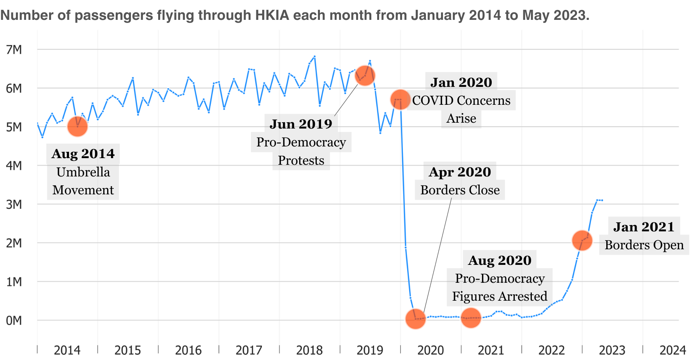

# About Me
I currently research and analyze data @[Mental Health Association of San Francisco](https://www.mentalhealthsf.org/). 

I'd like to do some good for the world through data-informed research. I graduated with a B.A. in Psychological Science and a minor in International Studies from the *University of California, Irvine*. My current interests, at the moment, revolve around [accessible cities](https://www.youtube.com/c/NotJustBikes), [foreign languages](https://www.italki.com), and [social mobility](https://opportunityinsights.org/). For fun, I enjoy spending time in nature and practicing my Chinese. 

I enjoy meeting new people, so feel more than welcome to email me at [rebeccatruong7@gmail.com](mailto:rebeccatruong7@gmail.com) . 

# Skills
For data analysis and visualization, I typically use Python and Microsoft Excel. If a project calls for it, I may use SQL, Tableau, and/or R. However, I'm constantly adding to my skillset!

**Python**: pandas, numpy, regex, matplotlib, seaborn   
**Microsoft Excel**: Pivot Tables, XLOOKUP, charting

# Projects
*still working on this section*

## Government Policies Have Dimmed the Pearl of the East: After a costly pandemic, air travel to Hong Kong has halved
I published an article detailing how Hong Kong's air traffic as changed in recent years and the potential reasons behind the change.   
- [Article](https://medium.com/@rebecca.truong)
- [Code-walkthrough](https://github.com/rebeccatruong7/Data-Projects/blob/main/HKG%20Code%20Walkthrough.ipynb))

 
