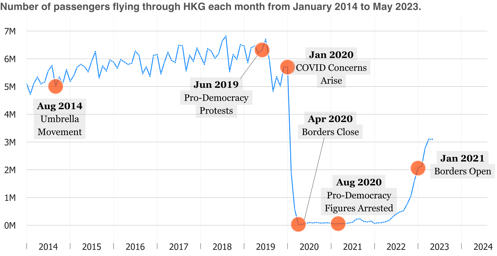

# About Me
I currently research and analyze data @[Mental Health Association of San Francisco](https://www.mentalhealthsf.org/). 

I'd like to do some good for the world through data-informed research. I graduated with a B.A. in Psychological Science and a minor in International Studies from the *University of California, Irvine*. My current interests, at the moment, revolve around [accessible cities](https://www.youtube.com/c/NotJustBikes), [foreign languages](https://www.italki.com), and [social mobility](https://opportunityinsights.org/). For fun, I enjoy spending time in nature and practicing my Chinese. 

I enjoy meeting new people, so feel more than welcome to email me at [rebeccatruong7@gmail.com](mailto:rebeccatruong7@gmail.com) . 

---

# Skills
For data analysis and visualization, I typically use Python and Microsoft Excel. If a project calls for it, I may use SQL, Tableau, and/or R. However, I'm constantly adding to my skillset!   

&nbsp;&nbsp;
&nbsp;&nbsp;
&nbsp;&nbsp;
   

**Python Libraries**: pandas, numpy, regex, matplotlib, seaborn   
**Microsoft Excel Tools**: Pivot tables, XLOOKUP, Charting   
**Soft Skills**:   
   Interpreting past & present events to understand context (Historical Research)   
   Writing to an uninformed audience   
   Sighing at the ~~grave~~ rabbit hole I've dug myself   

---

# Projects
**still working on this section so links may not work yet*   
Things I've been working on!
## Data Journalism 
### [Government Policies Have Dimmed the Pearl of the East](https://medium.com/@rebecca.truong): *After a costly pandemic, air travel to Hong Kong has halved.*
In this article, I explain how air travel to Hong Kong has changed and explain the socio-political reasons behind the change. This was a beginning-to-end project from finding the datasets, identifying my research question, cleaning the data, analyzing and visualizing the data, and then communicating its findings to an audience.   
[Article](https://medium.com/@rebecca.truong) | [Code-Walkthrough](https://github.com/rebeccatruong7/Data-Projects/blob/main/HKG%20Code%20Walkthrough.ipynb)   

   
## SQL Query
### [Nashville Housing](https://github.com/rebeccatruong7/Data-Projects/blob/main/Nashville%20Housing%20Data%20Cleaning%20Queries.sql) 
I cleaned a dataset containing information about housing units in Nashville, Tennesee. Columns include sale date, sale price, land value, and number of beds and baths. 

## Tableau Dashboards
### [Determine Equidistant Meeting Location](https://public.tableau.com/views/NextAlumniMeeting/Dashboard1?:language=en-US&:display_count=n&:origin=viz_share_link) 
The dashboard takes in cities and names to output an equidistant location based on the individuals selected. 
### [Seattle AirBnB Pricing](https://public.tableau.com/views/AirBnBFullProject_16555083090270/Dashboard1?:language=en-US&:display_count=n&:origin=viz_share_link ) 
The dashboard dsiplays the prices of AirBnBs in Seattle by a variety of variables including number of bedrooms, zip code, and time of year. 
 
