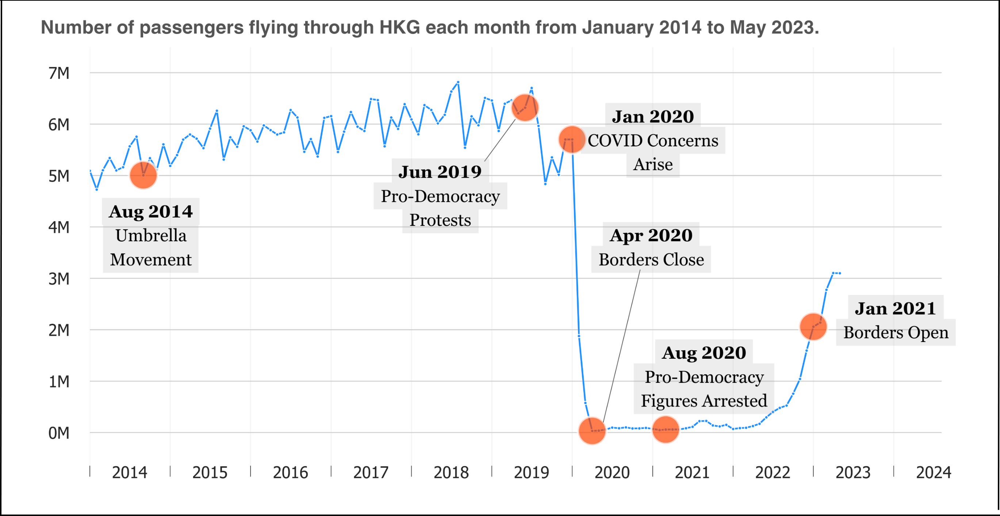

# Skills

| | | | |  
|:---:|:---:|:---:|:---:|  
|Python| Tableau| SQL| Microsoft Excel|  
|R| Power BI| STATA| html & css|  

and learning more.  

# Passion Projects

---

### CROISSANTS IN SAN FRANCISCO  

A fun video essay investigating the relationship between item pricing of croissants and neighborhood wealth in San Francisco. (Last updated in February 2025).  

Interact with the dashboards [here](https://public.tableau.com/views/sf_croissant_project/homepage?:language=en-US&:sid=&:redirect=auth&:display_count=n&:origin=viz_share_link).   
Find my code and final datasets on [github](https://github.com/rebeccatruong7/Data-Projects).

### HONG KONG AIR TRAVEL AMIDST POLITICAL TURMOIL     

A data journalism project investigating the dip in air travel in Hong Kong since the CCP's takeover. (Last updated in  July 2023).    

> "Hong Kong finally re-opened its borders to foreign travelers after two-and-a-half years of isolation. But the people aren’t returning so fast.  
A dark shadow has been cast on the Pearl of the Orient (東方之珠)."

Read the article on [medium](https://medium.com/@rebeccatruong7/government-policies-have-dimmed-the-pearl-of-the-east-bd0f1a855536).    
Find my code on [github](https://github.com/rebeccatruong7/Data-Projects).

# Work Experience

---

**SUPERIOR COURT OF CALIFORNIA, COUNTY OF ALAMEDA**  
*Dec 2023 - Mar 2024*   
During my brief time here, I assisted in building a new database and migrating data from the old database to the new one.     
➡️ Over the next 10 years, this new database will be pivotal in maintaining accurate and current court records. This project was an investment for the future so its impact remains to be seen.  

**MENTAL HEALTH ASSOCIATION OF SAN FRANCISCO**  
*Sep 2021 - Nov 2023*   
I began working here as a counselor for the [California Peer-Run Warm Line](https://www.mentalhealthsf.org/warm-line/) and slowly took on more projects outside my original role. As a data analyst, I advanced the organization by looking at the under-utilized call system data to:  
⭐ inform staffing, hiring, and shift-scheduling decisions  ➡️ resulted in a 72% improvement in answer rates over 3-6 months     
⭐ describe warmline performance in concrete terms ➡️ assisted in securing funding to increase headcount by 2X  
⭐ assess the impact of new programs/policies on the warm line ➡️ quantified the success of marketing campaigns in call count numbers for the first time  
⭐ update outdated performance metrics ➡️ resulted in changes to internal performance metrics  

# About Me

---

Hi, I am Rebecca! I am a junior data analyst with experience in non-profits and government. In spring 2021, I graduated from UC Irvine with a B.A. in Psychology and a minor in International Studies.  
   
🌍 My formal education reflects my curiosity about people, communities, and the power of individuals to organize together to accomplish amazing things.    
📚 Data analysis is a tool through which I tell those human stories because good decision-making can only happen with accurate and complete information.  
📍 Currently residing in the San Francisco Bay Area but open to relocation within the United States.    
  

❓ **CAREER GAP EXPLAINED** ❓  
You might be wondering why I have a gap in my resume following my job at the Superior Court of Alameda.  
🧓 I voluntarily left that position to become a full-time caregiver for a loved one who is doing much better now.  
🥖 In the time since I took on two part-time jobs in ingredient prep at a local bakery and cross-guarding for elementary schools. I have always wanted to try both!  
✨ I have also been polishing and learning new skills for data analysis, research, and storytelling. 
  

🐇 Now I am ready to hop back into the work sphere!

🌱 **HOBBIES** 🌱  
☀️ In my free time, I like being outside in nature and around people! I spend a lot of time training karate at my dojo or exploring the city streets. Sometimes, I feel like being a homebody so I'll clear my oven and bake up some delicious sweets.     

👋 **PLEASE REACH OUT** 👋  
📧 Happy to chat about my projects and work experience with you!  
Feel free to email me at: 

    rebeccatruong7@gmail.com
